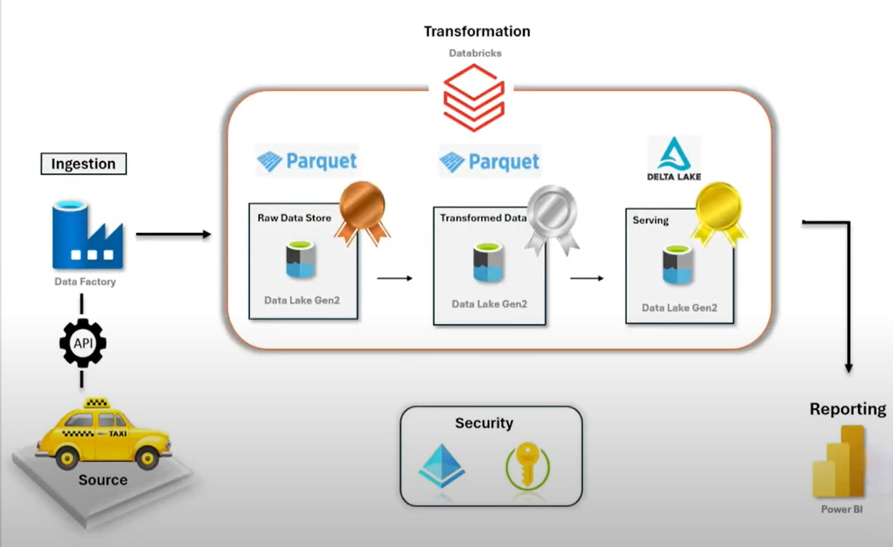

# NYC-Taxi-Azure-Data-Pipeline

### Project Overview
This project demonstrates a complete data pipeline for processing NYC Taxi data using **Azure Data Factory**, **Databricks**, and **Power BI**. The pipeline handles data ingestion, transformation, storage, and reporting in a modular and scalable manner.

### Architecture

### Technology Used
* **Azure Data Factory**: For data ingestion, scheduling, and workflow orchestration.
* **Databricks (Apache Spark)**: For data transformation, cleansing, and enrichment in the Silver layer.
* **Azure Data Lake Gen2**: For storing data across Bronze (raw), Silver (transformed), and Gold (analytical) layers.
* **Delta Lake**: Implemented in the Gold layer for optimized data storage and analytics.

### Dataset preview
* **Original Dataset Link**: [NYC TLC Trip Record Data](https://www.nyc.gov/site/tlc/about/tlc-trip-record-data.page)
* **Dataset Used**: 2023 Green Taxi Trip Records
  
The dataset includes information about taxi trip pickups, drop-offs, fares, passenger counts, and other details for green taxi trips in NYC during 2023.

### Pipeline Workflow
1. **Data Ingestion:**
* Utilized **Azure Data Factory (ADF)** to pull raw data from the NYC Taxi API.
* Stored the ingested data in the **Bronze layer** on **Azure Data Lake Gen2** for raw data archiving.

2. **Data Transformation:**
* Processed and enriched data in the **Silver layer** using **Apache Spark** within **Databricks**.
* Applied cleansing and transformation logic to ensure data quality and prepare it for analytics.

3. **Analytical Data Layer:**
* Designed the **Gold layer** with **Delta Lake**, storing aggregated and analytical-ready data in **Parquet format**.

4. **Reporting:**
* Built interactive dashboards in **Power BI**, leveraging the Gold layer to provide actionable insights and real-time analytics.

### Control Flow Implementation
**Key Components:**

* **ForEach Activity:** Loops over a range of values `(@range(1,12))` for iterative data copy operations.
* **IfCondition Activity:** Evaluates conditions for branching workflows:
  - **True:** Runs a copy activity for values less than or equal to 9 using specific parameters.
  - **False:** Runs a different copy activity for values greater than 9.

**Workflow Logic:**
1. The **ForEach activity** iterates 12 times to cover the full data range.
2. Inside the loop, the **IfCondition activity** directs the execution flow based on the evaluated condition.
    * **True:** Executes the Copy Data activity for values from 1 to 9.
    * **False:** Executes the Copy Data activity for values 10, 11, and 12.
3. Parameterized **Copy Data activities** ensure efficient and dynamic data movement based on the condition.
