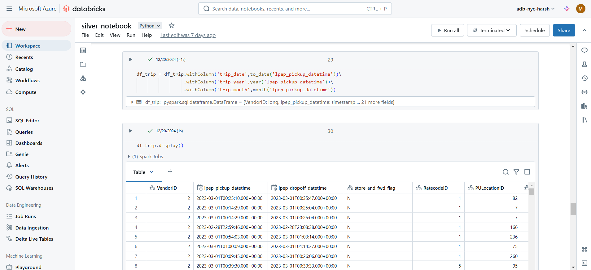

# NYC-Taxi-Azure-Data-Pipeline

### Project Overview
This project demonstrates a complete data pipeline for processing NYC Taxi data using **Azure Data Factory**, **Databricks**, and **Power BI**. The pipeline handles data ingestion, transformation, storage, and reporting in a modular and scalable manner.

### Architecture

### Technology Used
* **Azure Data Factory**: For data ingestion, scheduling, and workflow orchestration.
* **Databricks (Apache Spark)**: For data transformation, cleansing, and enrichment in the Silver layer.
* **Azure Data Lake Gen2**: For storing data across Bronze (raw), Silver (transformed), and Gold (analytical) layers.
* **Delta Lake**: Implemented in the Gold layer for optimized data storage and analytics.

### Dataset preview
* **Original Dataset Link**: [NYC TLC Trip Record Data](https://www.nyc.gov/site/tlc/about/tlc-trip-record-data.page)
* **Dataset Used**: 2023 Green Taxi Trip Records
  
The dataset includes information about taxi trip pickups, drop-offs, fares, passenger counts, and other details for green taxi trips in NYC during 2023.

### Pipeline Workflow
1. **Data Ingestion:**
* Utilized **Azure Data Factory (ADF)** to pull raw data from the NYC Taxi API.
* Stored the ingested data in the **Bronze layer** on **Azure Data Lake Gen2** for raw data archiving.

2. **Data Transformation:**
* Processed and enriched data in the **Silver layer** using **Apache Spark** within **Databricks**.
* Applied cleansing and transformation logic to ensure data quality and prepare it for analytics.

3. **Analytical Data Layer:**
* Designed the **Gold layer** with **Delta Lake**, storing aggregated and analytical-ready data in **Parquet format**.

4. **Reporting:**
* Built interactive dashboards in **Power BI**, leveraging the Gold layer to provide actionable insights and real-time analytics.

### Control Flow Implementation
1. **ForEach Activity:**
* **Purpose:** The `ForEach` activity will iterate over a range of values from 1 to 12.
* **Dynamic Content:** Each value in this range (1 to 12) will be evaluated by the `IfCondition` activity.
* **Implementation:** The `ForEach` activity will have a range of values from `1 to 12`, where each iteration will pass the current value to the `IfCondition` for further evaluation
* **Image Representation:**

2. **IfCondition Activity:**
* **Purpose**: This activity evaluates the current iteration value to determine if it is greater than 9.
* **Dynamic Content**:
    * The dynamic content used for evaluation is `@greater(item(), 9)`, which checks if the current item is greater than 9.
* **Implementation**:
    * **True (Greater Than 9)**: If the value is greater than 9, the `NYCGreaterThan9` activity is executed.
    * **False (Less Than or Equal to 9)**: If the value is 9 or less, the `Copy NYC Data` activity is executed instead.
* **Image Representation:**

3. **Copy Activity:**
* **Purpose:** The `Copy` activity is responsible for transferring data. It is parameterized and invoked based on the outcome of the `IfCondition` activity.
* **Implementation:** Depending on whether the value is greater than 9 or not, the `Copy NYC Data` activity or the `NYCGreaterThan9` activity is triggered accordingly.
* **Image Representation:** 

**Copy NYC Data**

**NYCGreaterThan9**

### Workflow Logic
* **ForEach Iterates over 1 to 12:**
    * The range (1 to 12) ensures that the iteration runs 12 times.
    * Each iteration will evaluate the current item (value) against the condition in the IfCondition activity.

* **IfCondition with Dynamic Content** `@greater(item(), 9)`:
  * The condition checks if the value is greater than 9:

    * If **True** (item > 9), it will trigger the `NYCGreaterThan9` activity.
    * If **False** (item <= 9), it will trigger the `Copy NYC Data` activity.

### Conclusion
This project highlights a scalable and modular approach to processing NYC Taxi data using Azure services. By leveraging the power of **Azure Data Factory**, **Databricks**, and **Power BI**, the pipeline ensures efficient **data ingestion**, **transformation**, and **reporting**. The architecture is designed to handle large datasets and provide actionable insights through interactive dashboards.
